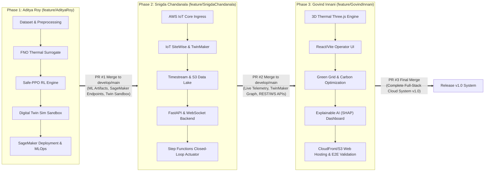

# AI-Driven Data Center Cooling Optimization: Cloud Architecture & Work Distribution Plan

## Executive Summary & Workflow Philosophy

This project is a multi-tier cloud and artificial intelligence engineering initiative: **"AI-Driven Sustainable Data Center Cooling Optimization Framework using Digital Twin Technology"**. 

To maintain high technical rigor while ensuring smooth collaboration, **every team member acts as a Cloud Architect** over their respective domain (Cloud AI MLOps, Cloud IoT & Backend Platform, Cloud Edge/UI & Sustainability Services). Work is executed in a **staged, sequential dependency pipeline**, where upstream components provide stable APIs, data contracts, and models for downstream integration:



---

## Actual Contribution Record (updated 2026-09-22, from real git history)

Everything below section "1." onward is the **original plan**, written before work started. In
practice the branch strategy shown above (one feature branch per phase, three sequential PRs) was
not followed literally — work was more iterative than the plan describes, and most integration
passes, bug sweeps, and the final real-AWS deployment were committed from one account. This section
replaces the plan with what the git log (`git log --format='%an|%s'`) actually shows, so it is not
overstated. Commit counts: **48 by Aditya Roy, 7 by Snigda Chandanala, 6 by Govind Innani.** A lower
commit count does not mean a smaller real contribution — see each person's list below.

### Aditya Roy — AI, digital twin, and final system integration
- **Phase 1 core** (as planned): real Frontier2023 dataset download, FNO thermal surrogate, Safe-PPO
  agent with a model-based safety shield, the calibrated digital-twin physics environment, an MPC
  baseline, and the ablation study that isolates the safety shield's measured value.
- Load forecaster comparison, the carbon-aware scheduler, and a real Water Usage Effectiveness (WUE)
  model.
- The auto-control loop that connects the trained agent to the live simulation, and the
  manual-command safety preview feature.
- Multiple full backend/frontend bug-hunt passes across the whole app (most of the "fix:" commits),
  the automated test suite, and CI configuration.
- The final measured-results write-up, the QA/report documents, and — beyond the original plan
  entirely — the **real AWS cloud deployment** on 2026-09-22 (EC2, S3, DynamoDB, Lambda, Step
  Functions, SNS, API Gateway, Cognito with a working login flow, TwinMaker entities, Glue Data
  Catalog, CloudWatch, Budgets).

### Snigda Chandanala — cloud IoT and backend platform (7 commits)
- `feat(phase2)`: the initial IoT ingestion simulator, FastAPI backend skeleton, TwinMaker connector,
  and orchestration code (`drift_trigger.py`).
- Multi-facility topology with per-facility control isolation (3 sites, independently controlled).
- `AWS_ENDPOINT_URL` support added across every boto3 client, plus the LocalStack bootstrap script —
  the plumbing that let the whole project test its AWS code for free before any real account existed.
- The scrape-time Prometheus `/metrics` endpoint (monitoring).
- The Pass-only Step Functions test workflow, with real LocalStack execution evidence.
- `docs/LOCALSTACK.md` (the LocalStack development guide).

### Govind Innani — dashboard, explainability, and final QA (6 commits)
- The live feature-attribution explainability API endpoint (`GET /api/v1/control/explain/...`) on the
  backend, and wiring the `SHAPExplanation.jsx` component on the frontend to actually call it, instead
  of showing a hardcoded example.
- Found and fixed 3 failing end-to-end tests, finalising the Phase 3 deliverables.
- The chart-generation script and the figures in `presentation/`.
- `docs/RESULTS.md`'s original measured-results write-up (with caveats) and `docs/FINAL_QA.md`'s
  end-to-end integration audit.

**If asked why one account has far more commits:** the honest answer is that after each person's
initial phase landed, most of the ongoing integration, bug-fixing across the whole stack, and the
final cloud deployment were done from one account rather than being re-distributed back across the
three feature branches the plan describes. Describe your own module from the list above rather than
arguing about the count.

### Planned vs. actual: what changed

**Process.** The plan called for 3 sequential feature branches, one PR each, merged in strict order
(Aditya → Snigda → Govind), each phase handing a stable API to the next. In practice, each person did
land an initial phase close to the plan, but almost everything after that — cross-stack bug fixing,
integration, and the AWS deployment — happened on one account instead of being re-distributed back
across the three branches. The hand-off pipeline in the diagram above didn't happen as drawn; it was
more iterative and centralised than planned.

**Per-person role vs. what they actually built:**

| Person | Planned scope | What they actually built |
|---|---|---|
| Aditya | AI/ML and the digital twin only (FNO, Safe-PPO, twin, SageMaker MLOps) | All of that, **plus** most cross-stack integration and bug fixing, the test suite, the water/forecaster/carbon models, **and** the entire real AWS deployment — services well outside his planned scope |
| Snigda | The full IoT/backend/cloud platform: IoT Core, SiteWise, TwinMaker, Timestream, RDS, FastAPI, Step Functions, EventBridge, ECS/EKS | Landed the real starting pieces (IoT simulator, FastAPI skeleton, TwinMaker connector, orchestration code), multi-facility topology, `/metrics`, and the LocalStack plumbing. **SiteWise, Timestream, RDS and ECS/EKS from her planned scope were never built by anyone** |
| Govind | Full-stack UI plus CloudFront, S3, API Gateway, Cognito, Lambda, CloudWatch | Landed the dashboard, the explainability endpoint and its UI wiring, E2E test fixes, charts, and the original results docs. **CloudFront, Cognito and CloudWatch from his planned scope were not built by him** — Cognito and CloudWatch were added later as part of the AWS deployment push, and CloudFront remains blocked by AWS itself |

**Services: planned vs. what's actually real:**

| Category | What happened |
|---|---|
| Built roughly as planned | IoT Core, TwinMaker (Snigda's scope); dashboard, SHAP, explainability (Govind's scope); FNO, Safe-PPO, the twin (Aditya's scope) |
| Planned, but never built by anyone | Timestream (turned out unavailable to new AWS accounts), RDS, ECS/EKS, QuickSight, a live SageMaker endpoint (all skipped as real cost with no functional benefit), SiteWise (blocked by an account gate) |
| Built, but **not assigned to anyone in the plan** | DynamoDB (the real Timestream substitute), API Gateway HTTPS, a real working Cognito login flow, the Glue Data Catalog, IoT Things, the TwinMaker entity graph, Lambda, a real Step Functions execution, SNS, CloudWatch, Budgets — all added during the AWS deployment push, not attributed to any one person's original phase |
| Blocked by AWS itself, an outcome the plan didn't anticipate | CloudFront, IoT Core's live message-broker delivery |

**Bottom line:** the plan assigned cloud services along strict per-person boundaries; reality blurred
those boundaries. The real, deployed system spans services from all three people's planned scopes
(IoT Core was Snigda's, Cognito/CloudWatch were Govind's, the deployment work itself was Aditya's),
plus several real services nobody was originally assigned. Most of what the plan intended did get
built somewhere in the project — just not always by the person or on the branch the plan assigned it
to.

---

## 1. Sequential Delivery Pipeline & Git Branch Strategy

All team members must work on their dedicated feature branches and follow this strict order of execution to prevent merge conflicts and dependency blockers:

| Phase | Developer | Feature Branch | Target Base Branch | Deliverables Summary |
|---|---|---|---|---|
| **Phase 1 (Start)** | **Aditya Roy** | `feature/AdityaRoy` | `develop` / `main` | AI models (FNO, Safe-PPO), Physics Environment, S3 Artifacts, SageMaker Inference & Training Scripts. |
| **Phase 2 (Next)** | **Snigda Chandanala** | `feature/SnigdaChandanala` | `develop` (rebased with Phase 1) | AWS IoT Core/SiteWise, TwinMaker models, Timestream DB schemas, FastAPI backend, Step Functions loop. |
| **Phase 3 (Final)** | **Govind Innani** | `feature/GovindInnani` | `develop` (rebased with Phase 2) | 3D React Dashboard, Carbon/WUE optimizer, SHAP visualizer, CloudFront deployment, E2E tests. |

---

## 2. Detailed Member-Wise Cloud Architecture Roles & Deliverables

```
                                  =======================================
                                  TEAM CLOUD ARCHITECTURE & ROLES
                                  =======================================
```

### 🧑‍💻 1. Aditya Roy (24BIT0328)
- **Primary Cloud Role**: **Cloud AI & MLOps Architect | Digital Twin Physics Lead**
- **Git Branch**: `feature/AdityaRoy`
- **Cloud Infrastructure Domain**: AWS SageMaker (Pipelines, Model Registry, Real-time Endpoints), Amazon S3 (Dataset & Weights Lake), Amazon ECR (Custom PyTorch/Gymnasium Docker Containers), AWS EventBridge (Model Drift Alarms).

#### Core Responsibilities & Modules:
1. **Dataset Ingestion & Feature Engineering**:
   - Download, clean, and standardize the Frontier Supercomputer 2023 dataset (`Frontier2023`, ORNL).
   - Generate normalized spatiotemporal tensors (coolant supply/return temperatures, mass flow rates, server IT loads, PUE).
2. **Fourier Neural Operator (FNO) Thermal Surrogate Model**:
   - Design and train the 2D/3D FNO network in PyTorch to replace slow CFD simulations for real-time rack/hall temperature prediction.
   - Achieve low latency inference (< 100ms) with $R^2 \ge 0.95$ and $MAE \le 0.4^\circ\text{C}$.
3. **Safe Reinforcement Learning (Safe PPO / SAC) Agent**:
   - Formulate Constrained Markov Decision Process (CMDP) with Lagrangian safety multipliers to ensure rack inlet temperatures remain strictly within ASHRAE thermal SLA bounds (18°C – 27°C).
   - Implement action space: Coolant supply setpoints, chilled water pump frequencies, and CRAC airflow control.
4. **Digital Twin Simulation Sandbox**:
   - Build a custom Gymnasium environment (`DataCenterCoolingEnv`) wrapping physics equations / ExaDigiT model.
5. **AWS SageMaker MLOps Pipeline**:
   - Write SageMaker-compatible inference handlers (`inference.py`) and training scripts.
   - Configure S3 bucket structure for model checkpoints, scaler artifacts, and evaluation metrics.

#### Files & Directory Deliverables:
- `dataset/` - Data ingestion and preprocessing scripts (`download_dataset.py`, `preprocess_telemetry.py`).
- `src/ai/surrogate/` - FNO neural operator model (`fno_model.py`, `train_fno.py`, `evaluate_fno.py`).
- `src/ai/rl/` - Safe PPO agent (`safe_ppo.py`, `reward_functions.py`, `train_rl.py`).
- `src/digital_twin/` - Simulation environment (`cooling_sim_env.py`, `physics_dynamics.py`).
- `src/aws/sagemaker/` - SageMaker pipeline definitions (`pipeline_definition.py`, `model_handler.py`).
- `models/` - Saved model weights and metadata (`fno_surrogate_v1.pt`, `safe_ppo_agent_v1.zip`).
- `testing/test_ai_models.py` - Unit tests for FNO and Safe-PPO.

---

### 👩‍💻 2. Snigda Chandanala (24BIT0330)
- **Primary Cloud Role**: **Cloud IoT & Telemetry Platform Architect | Backend Lead**
- **Git Branch**: `feature/SnigdaChandanala`
- **Cloud Infrastructure Domain**: AWS IoT Core (MQTT edge gateways), AWS IoT SiteWise (Asset Modeling & Metric Transforms), AWS IoT TwinMaker (Digital Twin 3D Scene Graph & Entity Bindings), Amazon Timestream (Time-series telemetry DB), Amazon RDS PostgreSQL (State Logs & System Config), AWS Step Functions & EventBridge (Closed-loop Orchestration), Amazon ECS/EKS (Containerized Microservices).

#### Core Responsibilities & Modules:
1. **IoT Ingestion & Telemetry Simulator**:
   - Implement MQTT telemetry publisher simulating industrial RTD temperature sensors, flow meters, and power meters streaming to AWS IoT Core.
   - Configure AWS IoT SiteWise asset hierarchy (Facility $\to$ Hall $\to$ Row $\to$ Rack $\to$ Cooling Distribution Unit (CDU)).
2. **AWS IoT TwinMaker Entity & Component Framework**:
   - Create TwinMaker workspace, entities, components, and data connectors linking live sensor streams to 3D spatial models.
3. **High-Performance Time-Series Data Lake**:
   - Design and set up Amazon Timestream tables for real-time sensor metrics and Amazon S3 Cold Storage for historical analytical queries.
   - Setup Amazon RDS PostgreSQL for user logs, alarm history, and setpoint override records.
4. **FastAPI Cloud Backend & WebSocket Microservices**:
   - Develop asynchronous FastAPI backend exposing REST endpoints for current telemetry, historical queries, and actuator setpoint overrides.
   - Implement real-time WebSocket channel streaming live facility metrics (PUE, temperatures, pump RPM) to the frontend.
5. **Closed-Loop Actuation Workflow**:
   - Deploy AWS Step Functions state machine that queries the current state from Timestream, calls Aditya's SageMaker inference endpoint, validates safety bounds, and publishes setpoint commands back via MQTT / BACnet edge connector.

#### Files & Directory Deliverables:
- `src/aws/iot/` - AWS IoT Core MQTT connector and SiteWise asset models (`iot_publisher.py`, `sitewise_models.json`).
- `src/aws/twinmaker/` - TwinMaker component definitions (`twinmaker_connector.py`, `scene_schema.json`).
- `src/aws/orchestration/` - AWS Step Functions state machine and EventBridge rules (`step_functions_workflow.json`, `drift_trigger.py`).
- `src/backend/` - FastAPI backend application (`main.py`, `api/v1/telemetry.py`, `api/v1/control.py`, `websockets/stream.py`).
- `database/` - Timestream query helpers and PostgreSQL migration scripts (`timestream_client.py`, `postgres_schema.sql`).
- `deployment/docker/` - Dockerfiles for backend services (`Dockerfile.backend`, `docker-compose.yml`).
- `testing/test_backend_iot.py` - Unit and integration tests for IoT & backend pipelines.

---

### 🧑‍💻 3. Govind Innani (24BIT0157)
- **Primary Cloud Role**: **Cloud Full-Stack & Green Cloud Sustainability Architect | UI/UX Lead**
- **Git Branch**: `feature/GovindInnani`
- **Cloud Infrastructure Domain**: AWS CloudFront (CDN), Amazon S3 (Static Web App Hosting), AWS API Gateway (REST/WebSocket API routing), AWS Cognito (Operator authentication & RBAC), AWS Lambda (External Green Grid API fetchers), AWS CloudWatch (Observability, Alarms & Dashboards).

#### Core Responsibilities & Modules:
1. **Interactive 3D Digital Twin Operator Dashboard (React + Three.js + TailwindCSS)**:
   - Build a responsive web console with real-time 3D spatial thermal heatmaps using Three.js (color-coded rack thermal gradients: Blue $\le 20^\circ\text{C}$, Green $20-25^\circ\text{C}$, Amber $25-27^\circ\text{C}$, Red $> 27^\circ\text{C}$).
   - Display real-time gauges for PUE, Facility Energy, IT Load, CDU Flow Rate, and Water Usage Effectiveness (WUE).
2. **Green Cloud Sustainability & Carbon-Aware Optimization Engine**:
   - Implement serverless AWS Lambda connector to fetch real-time grid marginal carbon intensity feeds (WattTime / Electricity Maps API) and ASHRAE ambient weather conditions.
   - Build multi-objective sustainability calculation layer balancing carbon emissions ($gCO_2e/kWh$) against cooling energy and PUE.
3. **Explainable AI (XAI) & Operator Safety Console**:
   - Integrate SHAP (SHapley Additive exPlanations) visual attributions into the UI, showing operators *why* the AI chose specific valve splits or pump speeds.
   - Build emergency manual override controls with instant cloud feedback to ensure human-in-the-loop safety.
4. **Cloud Frontend Deployment & API Gateway Integration**:
   - Configure AWS CloudFront + S3 distribution for high availability and low-latency frontend delivery.
   - Set up AWS Cognito authentication with role-based access control (Admin, Operator, Auditor).
5. **End-to-End Integration, Observability & Documentation**:
   - Set up CloudWatch dashboards and alert thresholds for thermal SLA breaches.
   - Finalize literature survey, system integration tests, user guides, and project report documentation.

#### Files & Directory Deliverables:
- `src/frontend/` - React + Vite + Three.js application (`src/components/ThreeDHeatmap.jsx`, `src/components/PUEGauge.jsx`, `src/components/CarbonTracker.jsx`, `src/components/SHAPExplanation.jsx`, `src/pages/Dashboard.jsx`).
- `src/aws/serverless/` - AWS Lambda functions for Grid Carbon & Weather ingestion (`lambda_carbon_fetcher.py`, `lambda_weather_fetcher.py`).
- `src/aws/cloudwatch/` - CloudWatch alarms, metrics, and dashboard templates (`cloudwatch_alarms.json`).
- `deployment/cloudformation/` or `deployment/terraform/` - Infrastructure as Code for CloudFront, S3, Cognito, and API Gateway (`frontend_infrastructure.yaml`).
- `testing/test_e2e_system.py` - End-to-end integration and load testing suite.
- `docs/` - Updated project report, system architecture guide, and API specifications (`Project_Report.md`, `API_SPECS.md`).

---

## 3. Team Responsibility & Traceability Matrix (RACI)

| Module / Component | Aditya Roy | Snigda Chandanala | Govind Innani |
|---|:---:|:---:|:---:|
| **Dataset Ingestion & Frontier2023 Preprocessing** | **R / A** | C | I |
| **FNO Neural Operator Physics Surrogate** | **R / A** | C | I |
| **Safe PPO Reinforcement Learning Controller** | **R / A** | I | C |
| **Digital Twin Physics Simulation Environment** | **R / A** | C | I |
| **AWS SageMaker Pipelines & ECR Containerization** | **R / A** | C | I |
| **AWS IoT Core Telemetry & SiteWise Asset Tree** | C | **R / A** | I |
| **AWS IoT TwinMaker Graph & Data Connectors** | C | **R / A** | I |
| **Amazon Timestream & S3 Storage Architecture** | I | **R / A** | C |
| **FastAPI REST/WebSocket Telemetry Microservice** | I | **R / A** | C |
| **AWS Step Functions Closed-Loop Actuator** | C | **R / A** | I |
| **Three.js 3D Rack Thermal Heatmap Engine** | I | C | **R / A** |
| **Green Grid Carbon & Sustainability Optimizer** | C | I | **R / A** |
| **SHAP Explainability & Operator Override UI** | C | I | **R / A** |
| **AWS CloudFront, S3 Hosting & API Gateway Auth** | I | C | **R / A** |
| **E2E Cloud System Testing & Project Documentation**| C | C | **R / A** |

*Key: **R** = Responsible (builds it), **A** = Accountable (owns quality), **C** = Consulted (provides inputs), **I** = Informed (consumes output).*

---

## 4. Technical Interfaces & Data Contracts Between Branches

To guarantee seamless integration across branches without breaking changes, the following standardized data schemas are strictly followed:

### Contract 1: Telemetry Payload (Published by IoT Core / Streamed by Backend)
```json
{
  "timestamp": "2026-09-18T12:00:00Z",
  "facility_id": "DC-EAST-01",
  "hall_id": "HALL-A",
  "rack_id": "RACK-04",
  "metrics": {
    "server_inlet_temp_c": 22.4,
    "server_outlet_temp_c": 36.1,
    "coolant_supply_temp_c": 19.5,
    "coolant_return_temp_c": 32.8,
    "flow_rate_lpm": 45.2,
    "it_power_kw": 28.5,
    "cooling_power_kw": 4.2,
    "pue": 1.147
  }
}
```

### Contract 2: AI Actuator Action Vector (Produced by Safe-PPO / Consumed by Step Functions & UI)
```json
{
  "action_id": "ACT-98234",
  "timestamp": "2026-09-18T12:00:10Z",
  "control_setpoints": {
    "chilled_water_temp_setpoint_c": 19.2,
    "cdu_pump_speed_pct": 74.5,
    "crac_fan_speed_pct": 68.0,
    "bypass_valve_split_pct": 15.0
  },
  "predicted_pue": 1.121,
  "estimated_carbon_rate_gco2e_per_h": 142.6,
  "safety_status": "WITHIN_SLA_BOUNDS",
  "confidence_score": 0.984
}
```

### Contract 3: Explainability & Carbon Context (Supplied by Lambda / Consumed by UI)
```json
{
  "grid_carbon_intensity_gco2e_per_kwh": 310.5,
  "grid_signal_level": "MODERATE_CLEAN",
  "shap_attributions": {
    "ambient_temp_c": 0.38,
    "it_workload_kw": 0.45,
    "grid_carbon_intensity": -0.12,
    "current_return_temp_c": 0.25
  }
}
```

---

## 5. Step-by-Step Execution & Push Sequence

### Step 1: Aditya Roy (`feature/AdityaRoy`)
1. Check out branch `feature/AdityaRoy`:
   ```bash
   git checkout feature/AdityaRoy
   ```
2. Implement AI Models, FNO surrogate, Safe PPO algorithm, Digital Twin simulation wrapper, and SageMaker scripts in `src/ai/`, `src/digital_twin/`, `src/aws/sagemaker/`.
3. Validate models using `testing/test_ai_models.py`.
4. Commit and push:
   ```bash
   git add .
   git commit -m "feat(ai): implement FNO thermal surrogate, Safe-PPO controller and SageMaker pipeline"
   git push origin feature/AdityaRoy
   ```
5. Open Pull Request `feature/AdityaRoy` $\to$ `develop`/`main`. Review and merge.

---

### Step 2: Snigda Chandanala (`feature/SnigdaChandanala`)
1. Sync branch with merged `develop`/`main`:
   ```bash
   git checkout develop
   git pull origin develop
   git checkout feature/SnigdaChandanala
   git rebase develop
   ```
2. Implement IoT Core simulator, SiteWise schemas, TwinMaker scene connectors, Timestream data layers, FastAPI backend, and Step Functions workflows.
3. Validate backend endpoints and telemetry pipeline using `testing/test_backend_iot.py`.
4. Commit and push:
   ```bash
   git add .
   git commit -m "feat(cloud-iot-backend): implement AWS IoT, TwinMaker graph, Timestream DB, and FastAPI services"
   git push origin feature/SnigdaChandanala
   ```
5. Open Pull Request `feature/SnigdaChandanala` $\to$ `develop`/`main`. Review and merge.

---

### Step 3: Govind Innani (`feature/GovindInnani`)
1. Sync branch with merged `develop`/`main`:
   ```bash
   git checkout develop
   git pull origin develop
   git checkout feature/GovindInnani
   git rebase develop
   ```
2. Implement React/Vite UI with Three.js 3D thermal heatmaps, Lambda carbon fetchers, SHAP attribution panels, CloudFront hosting configurations, and end-to-end tests.
3. Run comprehensive verification using `testing/test_e2e_system.py`.
4. Commit and push:
   ```bash
   git add .
   git commit -m "feat(frontend-green-cloud): implement 3D thermal heatmap dashboard, grid carbon optimizer, and E2E tests"
   git push origin feature/GovindInnani
   ```
5. Open Pull Request `feature/GovindInnani` $\to$ `develop`/`main`. Review and merge to produce final release `v1.0`.
